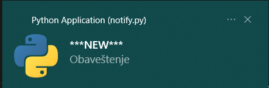

# ACS UNS Notifications

A simple desktop notifier that alerts you as soon as new notices or exam results are published on the ACS UNS website.

---

## What It Does

- Checks the faculty homepage every 60 seconds.
- Sends a desktop notification when a new announcement appears.
- Plays a sound (new.wav) for new notifications.
- Shows "OLD" for previously seen announcements.
- Simple GUI built with CustomTkinter.

---

## Preview



---

## Why I Built This

This was a quick 5-minute project I made so I no longer have to constantly refresh the faculty website waiting for exam results and important announcements.

---

## Technologies Used

- Python
- requests + BeautifulSoup4 (Web Scraping)
- notifypy (Desktop notifications)
- customtkinter (Modern GUI)
- Threading

---

## Installation & Usage

```bash
git clone https://github.com/yourusername/Notifications.git
cd Notifications
inslarr requirements
python main.py
